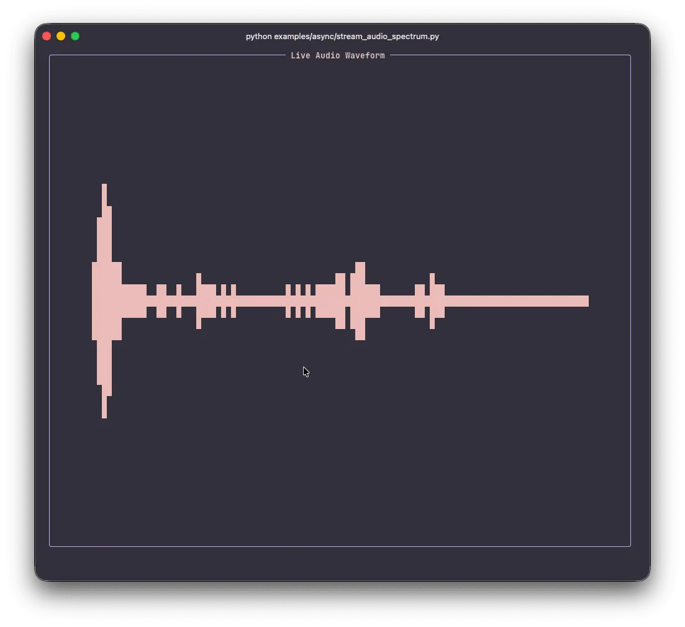

# Stream Audio

<!-- badge:product Neon -->
<!-- badge:companion +2.8.31 -->
<!-- badge:version +1.7 -->

Using the [`receive_audio_frames`][pupil_labs.realtime_api.streaming.receive_audio_frames] method, you can receive audio frames, which you can use it to listen live, record, or perform real-time analysis like speech-to-text or sound analysis.

The data returned is an instance of [`AudioFrame`][pupil_labs.realtime_api.streaming.audio.AudioFrame].

```py linenums="0"
AudioFrame(
    av_frame=<av.AudioFrame pts=None, 1024 samples at 8000Hz, mono, fltp at 0x1189e0ac0>,
    timestamp_unix_seconds=1758211800.8221593,
    resampler=<av.audio.resampler.AudioResampler object at 0x1189e04c0>
)
```

??? quote "AudioFrame"

    ::: pupil_labs.realtime_api.streaming.audio.AudioFrame

By default, audio is streamed in **mono** using the **AAC codec**. The stream is downsampled from the original 48 kHz source to a sampling rate of **8 kHz** to save bandwidth, and uses a **32-bit floating-point planar (fltp)** format.

The audio stream does not have it's own RTSP stream but is **multiplexed** with video, we create a virtual sensor component using the Scene Camera stream.

## Working with Audio Data

You can easily receive audio frames and convert them to NumPy arrays using the [`to_ndarray`][pupil_labs.realtime_api.streaming.audio.AudioFrame.to_ndarray] method and feed these to any audio library of your choice like [`librosa`](https://librosa.org/) for analysis.

??? example "Check the whole example code here"

    ```py title="stream_audio.py" linenums="1"
    --8<-- "examples/async/stream_audio.py"
    ```

For completeness, we have also included an example that shows how plot audio using librosa and rich on the terminal.

<figure markdown="span">
{ loading=lazy }
</figure>

??? example "Check the whole example code here"

    ```py title="stream_audio_spectrum.py" linenums="1"
    --8<-- "examples/async/stream_audio_spectrum.py"
    ```

## Playing Audio

Audio Playback in realtime can be tricky, here we use [SoundDevice](https://python-sounddevice.readthedocs.io/). This library digest NumPy arrays and allows to play them back quickly. The only caveat is that it does not accept 32 bit planar audio format, thus, we have to resample it.

For commodity, we included a PyAv `AudioResampler` object to the AudioFrame class, it lazy loads, and calling [`to_resampled_ndarray`][pupil_labs.realtime_api.streaming.audio.AudioFrame.to_resampled_ndarray] will convert convert the av.AudioFrame to a NumPy array in signed 16-bit integer format, which is supported by SoundDevice for playback.

To simplify development and ensure audio does not block your application, the examples include an [`AudioPlayer`][audio_player.AudioPlayer] class. It handles audio buffering and playback in a background process, using a circular buffer to guarantee smooth playback without glitches or silence.

??? example "Check the whole example code here"

    ```py title="stream_audio_and_play.py" linenums="1"
    --8<-- "examples/async/stream_audio_and_play.py"
    ```

## Playing Video and Audio

Here you can find an example that shows how to play both video with gaze overlay and audio using OpenCV and SoundDevice. Note that this is a example uses threading to handle both video and audio playback, which is not optimal, but works for demonstration purposes.

??? example "Check the whole example code here"

    ```py title="stream_video_gaze_and_audio.py" linenums="1"
    --8<-- "examples/async/stream_video_gaze_and_audio.py"
    ```

Alternatively, have a look at our simple examples, to see how to leverage [`AudioPlayer`][audio_player.AudioPlayer], which already uses a separate process.

??? quote "AudioPlayer"

    ::: audio_player.AudioPlayer

!!! tip "Bonus"

    On the simple API examples you can also find how to use the audio for Speech-to-Text using the `whisper` library.
